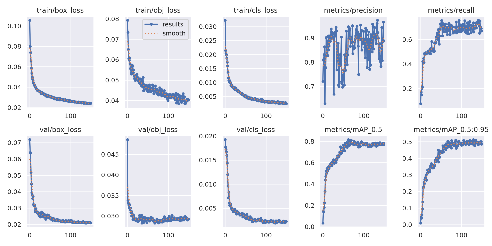
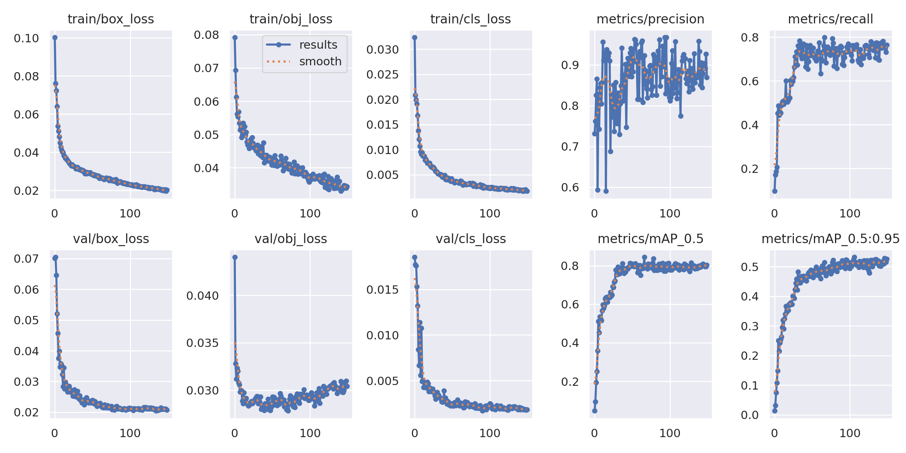
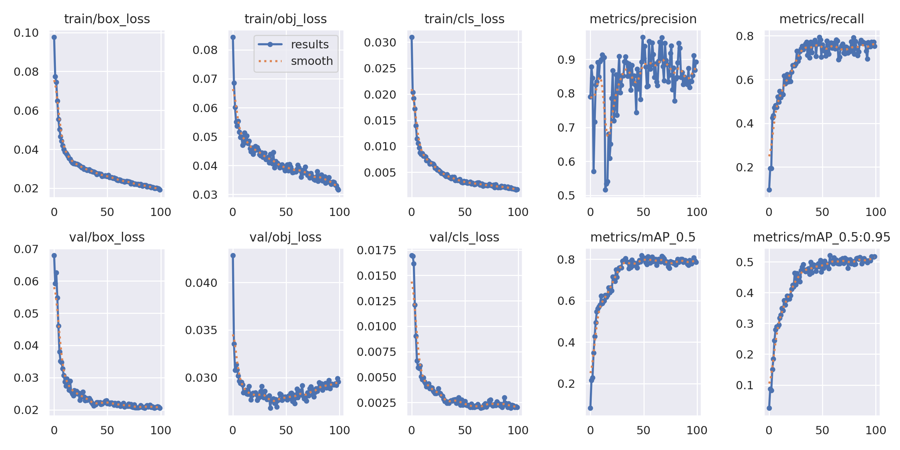

# Face Mask Detection with YOLOv5

In the face of respiratory diseases, and in particular the global health crisis posed by COVID-19, the wearing of masks has become an essential preventive measure. 
This project exploits the power of YOLOv5, a state-of-the-art object detection model, to build an efficient and accurate mask detection system. 
The aim is to identify people who are wearing masks correctly, those who are not, and those who are wearing them inappropriately.

## Installation 

Clone the repository
```bash
git clone https://github.com/CodeWithInnovation/Face-Mask-Detection
```
Install Yolov5 dependency using the requirements.txt file in a Python>=3.8.0 environment, including PyTorch>=1.8.
```bash
cd yolov5
pip install -r requirements.txt  # install
cd ..
```
Download <a href="https://www.kaggle.com/datasets/andrewmvd/face-mask-detection/">face mask</a> image data and store it on `dataset/`

## Preprocess Dataset

You need to preprocess the datasets, to export images and labels to YOLO format, with one *.txt file per image so the Yolov5 can train on it.

```bash
python create_dataset.py --config train-0.1.csv
```

Configure the path to the train and validation subset in `yolo-data.yaml` 

```bash
train: home/yolo_dataset/images/train,
val: home/yolo_dataset/images/valid
```

## Train YoloV5


1. Select a pretrained model to start training from, and download its weights. [Full table with all available models here](https://github.com/ultralytics/yolov5#pretrained-checkpoints).

[Source](https://docs.ultralytics.com/yolov5/tutorials/train_custom_data/)

2. Train the YOLOv5 model.
```bash
# example : yolov5m
cd yolov5
python train.py --img 640 --batch 4 --epochs 100 --data home/yolo-data.yaml --cfg models/yolov5m.yaml  --weights home/yolov5m.pt  --hyp home/hyp.yaml --name 'face_mask_yolov5'
```


3. You can use WandB to improve and enhance the training experience.


Weights & Biases (W&B) is a MLOps platform for tracking machine learning experiments. It allows us to build high quality models by providing experiment tracking, dataset versioning, and model monitoring capabilities.

Weights & Biases offers a range of features that can significantly improve a machine learning workflow:

- **Track, Compare, and Visualize Experiments**: Easily monitor and compare different experiments in one centralized dashboard. Visualize metrics, hyperparameters, and model performance over time.

- **Live Metrics and System Stats**: Get real-time updates on metrics, terminal logs, and system statistics. This live feedback is invaluable for understanding how the model is performing during training.

- **Explainability and Collaboration**: WandB can be used to explain how the model works. Showcase graphs illustrating how different model versions have improved, discuss bugs, and demonstrate progress towards project milestones. Facilitate collaboration among team members by providing a transparent view of the model development process.

4. Test the model
```bash
python test.py --path your_image --model your_model_path --conf 0.5 --iou 0.5
```

## Performances 
You can use our pre trained models available in `weights/` folder

```bash
python test.py --path your_image --model weights/face_mask_yolov5m.pt --conf 0.5 --iou 0.5
```

| Model | size | batch | mAP50<sup>val</sup>| mAP50-95<sup>val</sup>|
| ----| --- | --- |---|---|
| [Yolov5s](weights/face_mask_yolov5s.pt) | 640 |4|  78.41 |51.24|
| [Yolov5m](weights/face_mask_yolov5m.pt) | 640 |4| 80.60 | 53.18 |
| [Yolov5l](weights/face_mask_yolov5l.pt) | 640 |4| 80.37  | 52.06|

### Yolov5s Results 

### Yolov5m Results 

### Yolov5l Results 


## Citations 

> Yolov5 repository: https://github.com/ultralytics/yolov5

> Face Mask Dataset: https://www.kaggle.com/datasets/andrewmvd/face-mask-detection/
